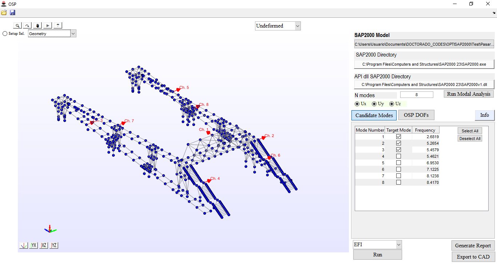

# OSP-SAP: Optimal Sensor Placement for SAP2000



**OSP-SAP** is a MATLAB-based Graphical User Interface (GUI) designed for **Optimal Sensor Placement (OSP)** in **SAP2000** finite element models. The software integrates four optimization algorithms to determine the best sensor locations for **Operational Modal Analysis (OMA)**, ensuring efficient structural monitoring.

## Features
- Intuitive **MATLAB AppDesigner** GUI.
- Direct integration with **SAP2000** FEM models.
- Implementation of four OSP algorithms:
  - **Effective Independence (EfI)**
  - **Mass Weighted Effective Independence (EfIwm)**
  - **Strain Energy Matrix Rank Optimization (SEMRO)**
  - **Kinetic Energy Matrix Rank Optimization (KEMRO)**
- Interactive visualization of results.
- Export sensor layouts as **AutoCAD (.dxf)** files and **Word (.docx)** reports.
- Open-source and customizable for further research.

## Installation
1. Ensure you have **MATLAB** installed.
2. Download the latest release from [GitHub](https://github.com/asanchezlc/OSP-SAP).
3. The GUI can be **directly run** by executing the following file:  
   **`Run_Interface.m`**  

   Alternatively, if you prefer, you can **install the app** as described below:
   - Open MATLAB and navigate to the downloaded `OSP_SAP.mlappinstall` file.
   - **Double-click** the file, or use the following command in MATLAB:
     ```matlab
     matlab.apputil.install('OSP_SAP.mlappinstall')
     ```
   - **Launch the app** from the **App Manager** in MATLAB.


## Usage
1. Load a **SAP2000** finite element model in `.xls` format.
2. Select target mode shapes and sensor constraints.
3. Choose one of the four OSP algorithms.
4. Run the optimization and analyze results via interactive visualizations.
5. Export the optimized sensor layout in **AutoCAD (.dxf)** and **Word (.docx)** formats.

## Citation [to be included!]
If you use **OSP-SAP** in your research, please cite:

@article{yourcitation, author = {López-Cuervo, Antonio S. and Garc\'{i}a-Mac\'{i}as, Enrique and Castro-Triguero, Rafael and Chiach\'{i}o-Ruano, Juan}, title = {OSP-SAP: A MATLAB graphical user interface for optimal sensor placement using SAP2000}, journal = {SoftwareX}, year = {2025}, doi = {--} } -->

## License
This project is licensed under the **MIT License**. See the [LICENSE](LICENSE) file for details.


